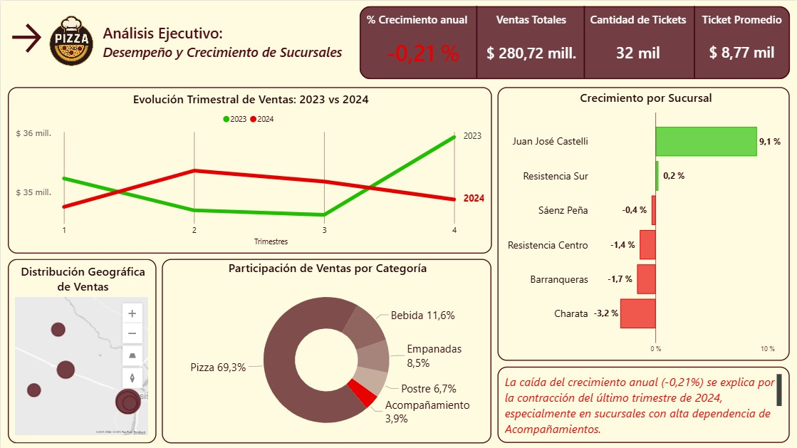
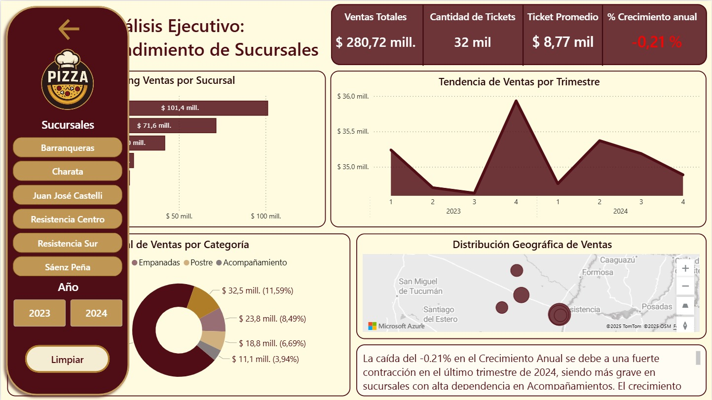

# Dashboard Final: Análisis Ejecutivo de Rendimiento de Sucursales

## Objetivo
Transformar los datos de ventas en un dashboard de Data Storytelling de un solo lienzo para identificar la causa del estancamiento y proponer acciones de negocio inmediatas.

## Hallazgos Clave (Smart Narrative)

1.  La caída del **-0.21% en el Crecimiento Anual** se debe a una fuerte contracción en el último trimestre de 2024, siendo más grave en sucursales con alta dependencia en Acompañamientos.
2.  El crecimiento positivo en Juan José Castelli y Resistencia Sur, con baja venta de esta categoría, valida que Acompañamientos no impulsa la rentabilidad sostenible.
3.  **Recomendación:** Redirigir la estrategia de venta cruzada, abandonando los incentivos de Acompañamientos para enfocarse exclusivamente en las categorías Bebidas y Postres.

---

## Vistas del Proyecto Final

### 1. Vista General del Dashboard (Con el Smart Narrative)

### 2. Vista de Detalle (Con el Panel de Filtros Desplegado)

---

## Archivos Entregados
* **Análisis de ventas Pizzería.pbix:** Contiene el dashboard final de un solo lienzo.
* **DOCUMENTACIÓN ANÁLISIS DE DATOS PIZZERÍA...:** Explica el flujo narrativo, las decisiones de diseño y la implementación técnica del KPI.

---
